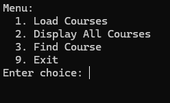
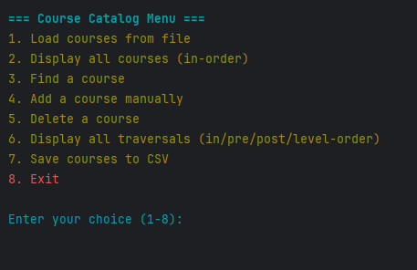
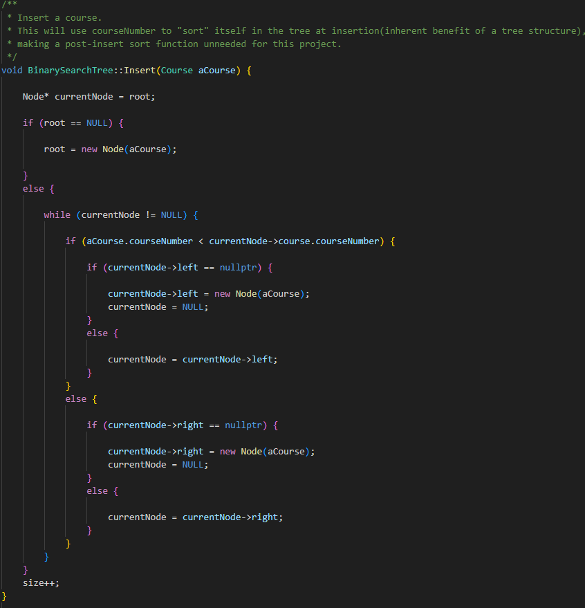
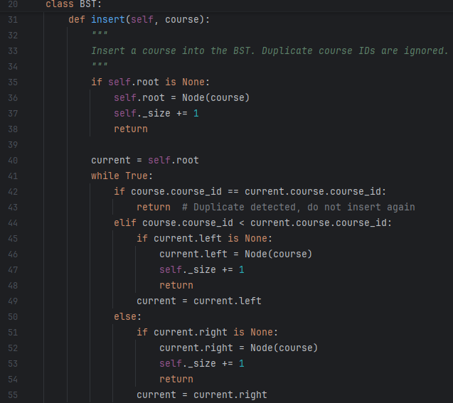
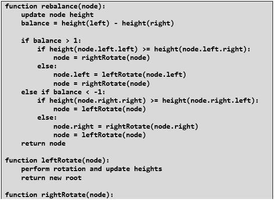
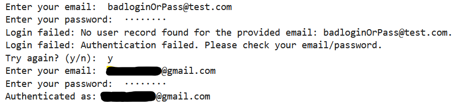

# CS499 | ePortfolio  

## Introduction & Self-Assessment
Hello, my name is Sonny Coutu. I began my journey toward a Bachelor’s degree in Computer Science with a concentration in Software Engineering in March 2023. Coming from a background with an IT associate degree, I brought over some credits, but I completed the majority of my core coursework from the ground up. This gave me the chance to immerse myself deeply in the discipline, building strong skills in software engineering, algorithms, and data structures, skills that I am eager to apply in the professional world.

Balancing full-time work, family life, and academic study has been both a challenge and a defining experience. As a working father of two, I refined my ability to manage time effectively, prioritize tasks, and adapt quickly. These lessons in discipline and organization have shaped not only my academic work but also my approach to problem-solving and professional growth.

Throughout my studies, I have strengthened my problem-solving skills by breaking complex challenges into manageable solutions, iterating designs, and balancing performance with maintainability. I have also cultivated strong collaboration and communication skills, learning to explain technical concepts clearly to varied audiences and to work effectively within diverse teams.

This ePortfolio represents the culmination of my work in the Computer Science program. It reflects not only technical proficiency but also the ability to enhance and adapt projects with thoughtful design, effective algorithms, and clean implementation. Collectively, these enhancements demonstrate my progress across all five course outcomes, showcasing a well-rounded portfolio and highlighting my capabilities as a competent and adaptable software developer. These experiences affirm my readiness to contribute meaningfully to the field of software engineering and underscore my commitment to continuous improvement as a professional developer.

---
## Portfolio Summary
The artifacts and enhancements included in this ePortfolio were chosen to showcase a broad range of technical and professional skills, reflecting the five course outcomes across three key areas:

- Software Design & Engineering

- Algorithms & Data Structures

- Databases
  
For enhancement one, I converted the original project into a new language, improving readability and modularity while keeping its core functionality intact. This created a more maintainable foundation that supports future development.

For enhancement two, I updated the data structure to improve efficiency and ensure consistent performance under different conditions. The project now includes mechanisms to maintain stability and correctness during operations.

For enhancement three, I refactored the backend to use a cloud-based service with secure authentication and better error handling. The structure was made more modular while keeping the interface and functionality consistent.  

## Course Outcomes
1. *Employ strategies for building collaborative environments that enable diverse audiences to support organizational decision-making in the field of computer science.*

2. *Design, develop, and deliver professional-quality oral, written, and visual communications that are coherent, technically sound, and appropriately adapted to specific audiences and contexts.*

3. *Design and evaluate computing solutions that solve a given problem using algorithmic principles and computer science practices and standards appropriate to its solution while managing the trade-offs involved in design choices.*

4. *Demonstrate an ability to use well-founded and innovative techniques, skills, and tools in computing practices for the purpose of implementing computer solutions that deliver value and accomplish industry-specific goals.*

5. *Develop a security mindset that anticipates adversarial exploits in software architecture and designs to expose potential vulnerabilities, mitigate design flaws, and ensure privacy and enhanced security of data and resources.*

---
## Code Review Video

My code review for these artifacts goes through each project’s existing functionality and notes areas for improvement. For each artifact, I discuss what works, what could be improved, and the planned enhancements. This review reflects a practical look at the code and my thought process for making it better.



---
## Artifact Introduction

The artifacts presented in this ePortfolio showcase a progression of technical skill and problem-solving abilities developed throughout my Computer Science program. Each artifact reflects a different focus area within software engineering, including algorithmic optimization, advanced data structures, and database design and security. Together, these projects demonstrate my ability to adapt and improve existing systems, apply sound engineering principles, and integrate industry-standard tools to deliver efficient, secure, and maintainable software solutions. 

## [*Artifact 1 — BST Course Catalog Conversion to Python*](https://github.com/scoutu-SNHU/scoutu-SNHU.github.io/tree/main/SoftwareEngDesign)

The first artifact in my portfolio is a course catalog application originally developed in C++ for CS300: Data Structures and Algorithms. For this enhancement, I converted the binary search tree (BST) implementation into Python, improving readability, maintainability, and modularity while preserving its core functionality. The program reads course data from a CSV file, supports searching for courses by ID, and displays ordered traversals, ensuring efficient data retrieval and accurate prerequisite validation.

This enhancement demonstrates my ability to translate complex data structures between languages while maintaining efficiency and correctness. It also highlights my skills in modular design, object-oriented programming, file handling, and user interface improvement. By restructuring the program and improving its organization, I created a foundation that supports future expansion and easier collaboration.

This artifact reflects several course outcomes: employing collaborative coding strategies through modular design and documentation; delivering professional-quality communication via clean code and structured console output; designing and evaluating algorithmic solutions through BST implementation; and demonstrating innovative use of Python’s capabilities for efficient data handling.
<h4>C++ Vs Python</h4>
C++ menu is on top, Python underneath. Options were added to the code, reflected in this menu, and the menu itself was improved to be more visually pleasant.   

   
Below is an example comparison of the insert() function for both codebases.  

 
<link rel="stylesheet" href="assets/css/custom.css">

  <a href="https://github.com/scoutu-SNHU/scoutu-SNHU.github.io/blob/main/SoftwareEngDesign_narrative.pdf" class="button">Full Narrative</a>
  <a href="https://github.com/scoutu-SNHU/scoutu-SNHU.github.io/tree/main/SoftwareEngDesign/Original_CPP" class="button">Original Artifact</a>
  <a href="https://github.com/scoutu-SNHU/scoutu-SNHU.github.io/tree/main/SoftwareEngDesign/Enhanced_Python" class="button">Enhanced Artifact</a>

 

---
## [*Artifact 2 — BST to AVL Tree Conversion in C++*](https://github.com/scoutu-SNHU/scoutu-SNHU.github.io/tree/main/AlgorithmsDataStruct)

The second artifact is a continuation of the course catalog project, focusing on converting the existing binary search tree (BST) in C++ into a self-balancing AVL tree. This enhancement improves efficiency for insertions, deletions, and searches by maintaining optimal tree height, even in the face of large datasets. The project now includes robust balancing logic, rotation operations, height tracking, and a debug mode that visually illustrates balancing operations during runtime.

This enhancement demonstrates advanced algorithmic thinking, expertise in C++ programming, and attention to maintainable design. Implementing AVL balancing required careful pointer management, modularization of rotation and rebalance functions, and structured exception handling to maintain stability. This project highlights my ability to implement complex algorithms while ensuring code clarity and reliability.

This artifact aligns with multiple course outcomes, including creating collaborative environments through clear structure and documentation, delivering professional-quality communications, applying algorithmic principles to optimize solutions, implementing innovative data structure techniques, and fostering a security mindset through rigorous memory management and exception handling.
<h4>Pseudocode for rebalance()</h4>

  <a href="https://github.com/scoutu-SNHU/scoutu-SNHU.github.io/blob/main/AlgoDataStructure_narrative.pdf" class="button">Full Narrative</a>
  <a href="https://github.com/scoutu-SNHU/scoutu-SNHU.github.io/tree/main/AlgorithmsDataStruct/Original_CPP" class="button">Original Artifact</a>
  <a href="https://github.com/scoutu-SNHU/scoutu-SNHU.github.io/tree/main/AlgorithmsDataStruct/CourseCatalogAVL" class="button">Enhanced Artifact</a>

 

---
## [*Artifact 3 — Animal Shelter Dashboard with Firebase*](https://github.com/scoutu-SNHU/scoutu-SNHU.github.io/tree/main/Databases)

The third artifact is the Animal Shelter Dashboard, originally developed in Python using Dash for CS-340: Client/Server Development. The dashboard visualizes adoption data through maps, charts, and filters. For this enhancement, I replaced the original local MongoDB backend with Firebase, implementing cloud-based storage and secure user authentication.

This enhancement demonstrates my ability to modernize a full-stack, data-driven application while maintaining modular and maintainable code. By integrating Firebase’s Firestore, the dashboard gained real-time data access and improved scalability. Implementing Firebase Authentication enabled secure login and robust error handling. Refactoring the AnimalShelter class to separate authentication logic from database operations highlights my skills in backend integration, secure software design, and clean code organization.

This artifact aligns with multiple course outcomes: fostering collaborative practices through structured, reusable code; delivering professional-quality communication via clear backend logging; designing and evaluating secure, scalable data solutions; applying innovative software engineering techniques for cloud integration; and developing a security mindset through proper credential handling and error management. Overall, this enhancement reflects practical, real-world skills in secure, cloud-based application development.
   
The below picture shows login attempts using the email/password method enabled in the Firebase dashboard.
 

 

  <a href="https://github.com/scoutu-SNHU/scoutu-SNHU.github.io/blob/main/Database_narrative.pdf" class="button">Full Narrative</a>
  <a href="https://github.com/scoutu-SNHU/scoutu-SNHU.github.io/tree/main/Databases/Original_340_jupyter_dashboard" class="button">Original Artifact</a>
  <a href="https://github.com/scoutu-SNHU/scoutu-SNHU.github.io/tree/main/Databases/Dashboard_DB_Enhancement3" class="button">Enhanced Artifact</a>

